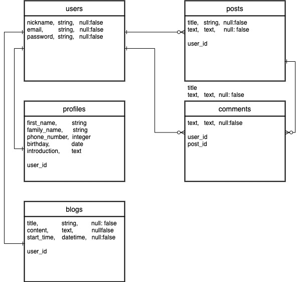

# Job Start 
#### 就活を円滑に進めることが出来るアプリです

## アプリケーション概要
- 就活についての悩みを解決することができます。
- カレンダー機能により、日々の予定を入力することで、確認ができます。
- ツイート機能により、他のユーザーの質問や、つぶやきを見ることができます。
- コメント機能により、他のユーザーのツイートに対してコメントしたり、コメントをもらうことが出来ます。
- ツイート欄での検索機能によりツイートを検索できることができます。
- カレンダー欄での検索機能により、予定や内容を確認することができます。

### URL 
- https://job-start.herokuapp.com

### テストアカウント
- Email: test@test
- password: qwe123

## 利用方法 (このアプリケーションの利用方法を説明しましょう。)
#### 就職活動を円滑に進めるためのアプリです。就職活動の悩みなどを共有し、問題解決が出来る仕様のアプリとなっております。画像投稿機能により、履歴書や職務経歴書などを共有することもできます。又、アプリ内のカレンダー機能で今後の予定や、過去のダイアリーを確認することができます。

## 目指した課題解決(このアプリケーションを通じて、どのような人の、どのような課題を解決したかったかを書きましょう。)

## 実装要件

### ユーザー機能
- 新規登録(Nickname、Email、Passwordを入力)を行い、ログインできるようにしています。
- ログイン(Email、Password)を入力し、ログインできます。
### ツイート機能	
- ユーザーが投稿したツイートを見ることができます。
- タイトル、テキスト、画像(任意)を入力することでツイートを投稿できます。
- ログインをしていることが前提です。

### カレンダー機能
- タイトルとコンテンツ(内容)、時間を入力し保存することができます。
- コンテンツは任意で投稿出来ます。
- ログインをしていることが前提であり、他のユーザーからは閲覧できないようになっています。
- タイトルのみ、カレンダーの一覧ページに表示されます。タイトルをクリックしたら、テキスト、時間を見れるようにしています。

### 検索機能
- ログインをしていない状況でも検索することができます。
- ツイート欄でのフォームで検索した際は、該当するツイートを探し出すことができます。
- カレンダー欄でのフォームで検索した際は、該当する予定、日記を探し出すことができます。

### コメント機能
- コメントをするには、ログインしていることが前提です。
- 閲覧するのは、ログインしていない状況でも可能です。
- コメントには誰がコメントしたかがわかるようにするために、ニックネームを表示させています。
- 削除、編集機能によりコメントを自由に編集することができます。

### プロフィール機能
- ログインしていることが前提です。
- プロフィールを好きなように投稿することができます。
- 投稿されたツイートから、投稿者のプロフィールを見ることができます。
- 自身のツイート一覧を確認できます。

### 実装予定の機能

# ER図
## テーブル設計

## users テーブル

| Column   | Type   | Options     |
| -------- | ------ | ----------- |
| nickname | string | null: false |
| email    | string | null: false |
| password | string | null: false |

### Association

- has_many :tweets
- has_many :comments
- has_one  :calendar
- has_one  :profile

## posts テーブル

| Column | Type       | Options                        |
| ------ | ---------- | ------------------------------ |
| title  | string     | null: false                    |
| text   | text       | null: false                    |
| user   | references | null: false, foreign_key: true |

### Association

- belongs_to :user
- has_many :comments

## comment テーブル

| Column | Type       | Options                        |
| ------ | ---------- | ------------------------------ |
| text   | text       | null: false                    |
| user   | references | null: false, foreign_key: true |
| post   | references | null: false, foreign_key: true |

### Association

- belongs_to :user
- belongs_to :post

## blogs テーブル

| Column     | Type       | Options                        |
| ---------- | ---------- | ------------------------------ |
| title      | string     | null:false                     |
| content    | text       |                                |
| start_time | datetime   | null:false                     |
| user       | references | null: false, foreign_key: true |

### Association

- belongs_to :user

## blogs テーブル

| Column     | Type       | Options                        |
| ---------- | ---------- | ------------------------------ |
| title      | string     | null:false                     |
| content    | text       |                                |
| start_time | datetime   | null:false                     |
| user       | references | null: false, foreign_key: true |

### Association

- belongs_to :user

## profile テーブル

| Column       | Type      | Options                         |
| ------------ | --------- | ------------------------------- |
| first_name   | string    | null:false                      |
| family_name  | string    | null:false                      |
| phone_number | integer   | null:false                      |
| birthday     | date      |                                 |
| introduction | text      | null:false                      |
| user         | references | null: false, foreign_key: true |

### Association

- belongs_to :user

# ページ遷移図

